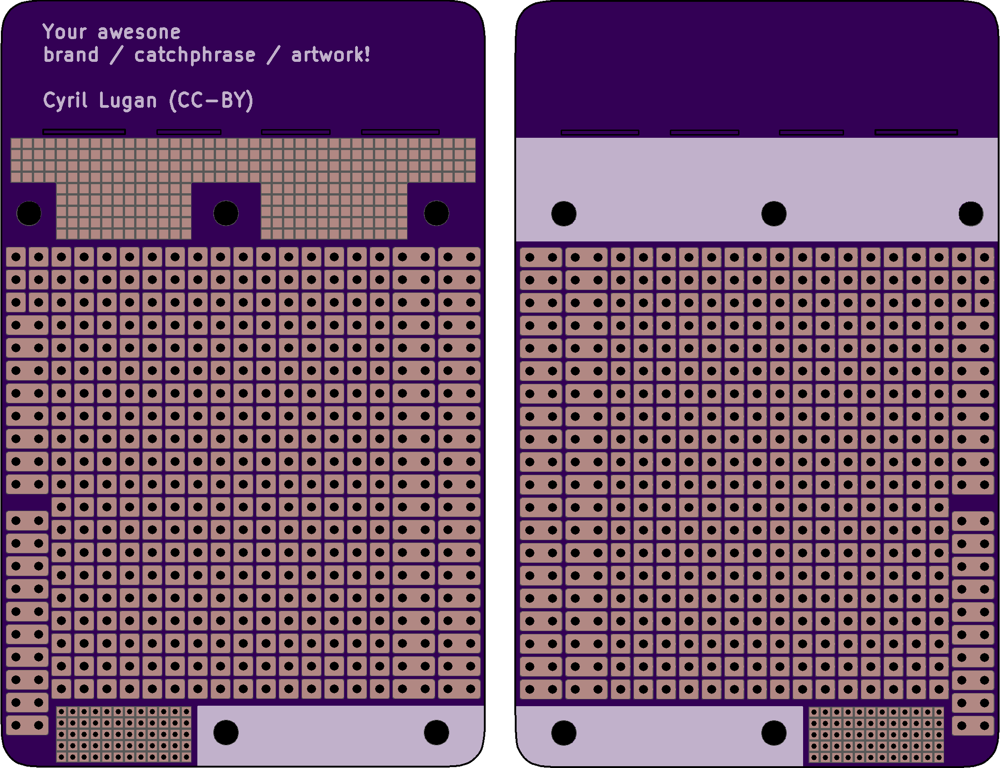

# Prototype / Perfboard PCB Business Card

## Features

- Arduino Shield
- Raspberry Pi Hat with 2 mounting pads
- Large 2.54 mm / 100 mil perfboard area (usable with breadboard friendly evaluation boards like Feather)
- Small 1.27 mm / 50 mil perfboard area
- Small 1.27 mm / 50 mil SMT pad area
- Silkscreen area for marker notes
- Blank area to add business contact, can be clipped off

## Notes

- 54 x 86 mm PCB area
- Fits nicely in a card holder with a PCB thickness below 1 mm
- Silkscreen areas might not look very good when made by the cheapest manufacturers
- Manufacturer might add an order id on the PCB, check if you can disable it or specify its location
- Try a small batch before making hundreds of them

## Credits

PCB design by [Cyril Lugan](https://cyril.lugan.fr), licensed under a [Creative Commons Attribution 4.0 International License](http://creativecommons.org/licenses/by/4.0/).

Previews generated on [OSH Park](https://oshpark.com/).